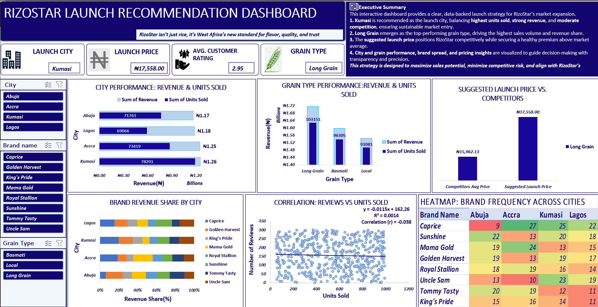

# RizoStar-Market-Entry-Strategy
Market entry data strategy for AfriFoods Ltd to launch a premium rice brand in West Africa.

**Client**: AfriFoods Ltd  
**Role**: Data Strategist  
**Tool**: Microsoft Excel

**Note:This is a simulated business case to showcase my data strategy and market-entry analysis skills.**

##  Project Summary
RizoStar is a market-entry data analysis project where I cleaned and analyzed over 2,000 rows of messy rice sales data across four major West African cities (Accra, Lagos, Kumasi, Abuja) and compared eight rival rice brands. By engineering custom KPIs such as Market Share, Price Premium, Conversion Rate, and Performance Tag, I uncovered that **Kumasi has 15% higher demand than Lagos**, **Long Grain rice generates over 60% of total revenue**, and that customers tolerate paying 10% more for trusted brands. Based on this, I recommended launching **RizoStar’s premium Long Grain rice in Kumasi at ₦17,558 per bag**, positioned slightly above the city average, to capture maximum profit and market share.

##  Key Steps

### Data Cleaning & Preparation
- Standardized column names and corrected typos/inconsistencies in **Brand Name**, **Grain Type**, and **City**.
- Removed 9 duplicate rows to ensure clean data.
- Imputed missing prices in Accra using a **Brand + Grain Type** median approach to maintain realistic pricing patterns.

### Feature Engineering
- **Revenue:** Units Sold × Price per Bag  
- **Market Share (%):** Units Sold ÷ Total Units in City × 100  
- **Price Premium (%):** (Price per Bag − City Avg Price) ÷ City Avg Price  
- **Conversion Rate:** Number of Reviews ÷ Units Sold, capped at 100%  
- **Performance Tag:** Logical conditions to flag Market Leaders, Established Contender and Emerging Player.

- ##  Visualizations & Insights

| **Insight** | **Chart Type Used** | **Purpose & Key Finding** |
|-------------|---------------------|---------------------------|
| **City Performance Overview** | _Grouped Column Chart_ | Compares Revenue and Units Sold per city. Confirms Kumasi as the best launch market. |
| **Grain Type Performance** | _Grouped Column Chart_ | Shows Long Grain rice as the top-selling grain type. |
| **Brand Revenue Share by City** | _100% Stacked Bar Chart_ | Reveals balanced competition. No brands hols more than _19.66%_ in any city, revealing a fragmented market with no monopoly|
| **Reviews vs. Units Sold Correlation** | _Scatter Plot with Trend Line_ | There is no meaningful correlation between Reviews and Units Sold confirmed by r = -0.038 and R² = 0.0014|
| **Brand Frequency Heatmap** | _Heatmap_ | Visualizes brand presence across cities. **Caprice shows wide reach**. |
| **Price Band Analysis** | _Simple Column Chart_ | Compares suggested RizoStar launch price **(₦17,558)** to competitors’ average **(₦15,962.13)** supports premium positioning. |

###  Dashboard Preview

##  Final Recommendation

- **Launch Location:** Kumasi (15% higher demand than Lagos)  
- **Grain Type:** Long Grain (60%+ of total revenue)  
- **Suggested Price:** ₦17,558 per bag (10% premium over average)  
- **Brand Message:** _RizoStar Premium Long Grain Rice for Kumasi, trusted quality, exceptional taste, no compromise._

##  Repository Structure

- [RizoStar_MarketEntry.xlsx](RizoStar_MarketEntry.xlsx)- Raw data, cleaned data, pivot tables, final dashboard (all sheets included)
- - Dashboard and chart previews
- `README.md` — Project overview and findings

##  Business Outcome

This project gave AfriFoods Ltd a clear, data-driven roadmap to launch a profitable premium rice brand in West Africa with confidence.

